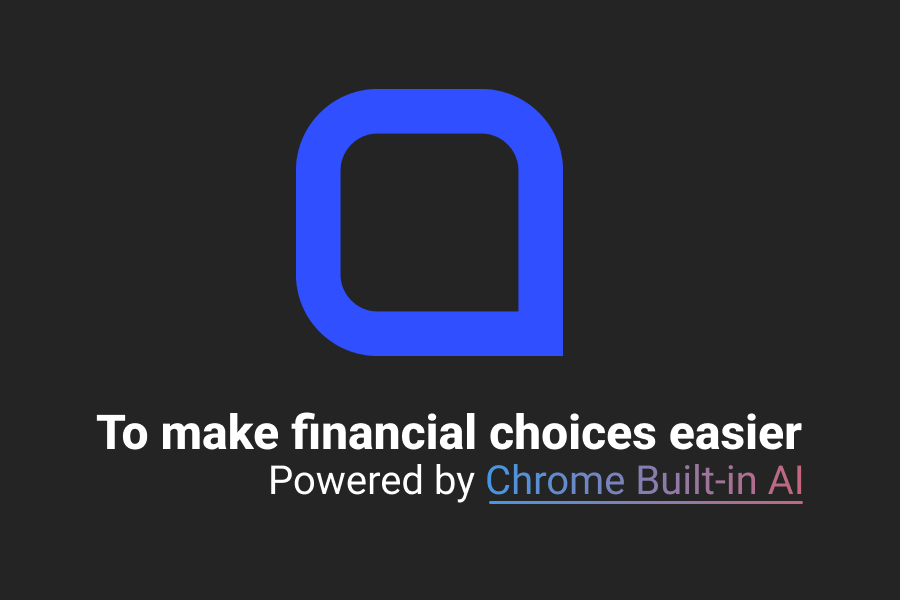
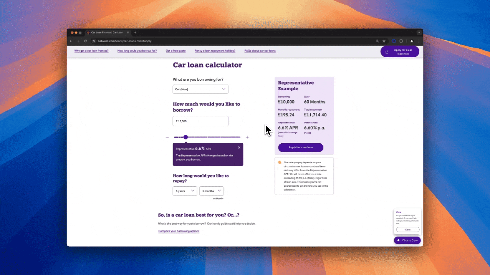

# Here - Chrome extension with Built-in AI

Here is a Chrome extension built to support vulnerable users through complex financial decision-making, providing timely tips, summaries, and chat assistance.

This repository follows a [Turborepo](https://turbo.build/) structure, allowing for efficient management and sharing of code between different parts of the project.

## Key Directories

- `apps/chrome-extension`: The core Chrome extension code, containing all assets, background scripts, and the main manifest.json file.
- `apps/here-chat-app`: React application to handle chat-related UI components and support services.
- `apps/support-chat-service`: NestJS backend service that connects to Google Gemini for AI-powered insights.
- `apps/vulnerability-helper`: Chrome extension content script for detecting user interaction patterns and generating tips.

> [!NOTE]
> Please follow the latest instructions from [nodejs-vertexai](https://github.com/googleapis/nodejs-vertexai) repo

## Getting Started

### Prerequisites

1.  Make sure your node.js version is 18 or above.
1. Access to Chrome Built-in AI Early Preview Program
1.  [Select](https://console.cloud.google.com/project) or [create](https://cloud.google.com/resource-manager/docs/creating-managing-projects#creating_a_project) a Google Cloud project.
1.  [Enable billing for your project](https://cloud.google.com/billing/docs/how-to/modify-project).
1.  [Enable the Vertex AI API](https://console.cloud.google.com/flows/enableapi?apiid=aiplatform.googleapis.com).
1.  [Install the gcloud CLI](https://cloud.google.com/sdk/docs/install).
1.  [Initialize the gcloud CLI](https://cloud.google.com/sdk/docs/initializing).
1.  Create local authentication credentials for your user account:

    ```sh
    gcloud auth application-default login
    ```

### Building the Extenstion

1. **Setup NodeJS environment with `nvm`**

   - Follow the [nvm installation instruction](https://github.com/nvm-sh/nvm?tab=readme-ov-file#installing-and-updating) to install `nvm`
   - Run the following command to setup NodeJS environment

   ```bash
   nvm use
   ```

1. **Configure `npm` as package manager**

   ```bash
   corepack enable
   ```

1. **Install dependencies**<br>
   Run the following command to install all dependencies:
   ```bash
   npm install
   ```
1. **Build the applications**<br>
   Use the Turborepo command to build the applications:
   ```bash
   npm run turbo:build
   ```

### Using The Extension Locally

1. **Setup environment variables for Vertex API**<br>
   - Create a `.env` from `.env.sample`
   ```bash
   cd apps/support-chat-service
   cp .env.sample .env
   ```
   - Set the Google Cloud project ID, location and Vertex AI model from `.env` respectively
1. **Start backend service**
   ```bash
   cd apps/support-chat-service
   npm run dev
   ```
1. **Install the extension from Chrome**
   - Go to the Extensions page by entering `chrome://extensions` in a new tab.
   - Enable Developer Mode by clicking the toggle switch next to **Developer mode**.
   - Click the **Load unpacked** button and select the extension directory - `apps/chrome-extension` from your local machine
     

> [!NOTE]
> Please follow the latest instructions from [Chrome for Developers](https://developer.chrome.com/docs/extensions/get-started/tutorial/hello-world)


## Tech Stack
- Frontend: [React](https://react.dev/) (in apps/vulnerability-helper and apps/here-chat-app)
- Backend: [NestJS](https://nestjs.com/) (in apps/support-chat-service)
- AI Integration: Google Gemini with Vertex AI (for insight generation)
- Monorepo: Managed with [Turborepo](https://turbo.build/) to allow for shared utilities and efficient development.

## Features
1. **Vulnerability Detection**: Monitors user interactions (e.g., multiple clicks on the same content or repeated editing in fields) to identify vulnerable users. A contextual tip is generated to help users understand financial terms.

1. **Insight Generation**: Offers detailed insights when a user appears to need help, such as explaining how specific content affects financial decisions.
1. **Text Summarisation**: Allows users to highlight and summarize long texts, helping them quickly understand complex documents.

1. **Chat Assistance**: Users can open a chat to get additional support based on their needs and questions.


## Challenges and Future Work
- **Challenges**: Detecting vulnerability patterns accurately across different user behaviors and creating a seamless UI that integrates well with varied website designs.
- **Future Plans**:
    - Integrate data collection to refine user behavior insights.
    - Enhance prediction of vulnerable behaviors using Vertex AI.
    - Develop a custom model to further improve accuracy in assisting users with financial decisions.

## License
This project is licensed under the Apache License 2.0. See the [LICENSE](./LICENSE) file for details.